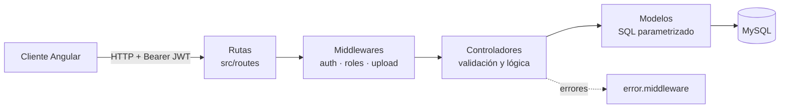
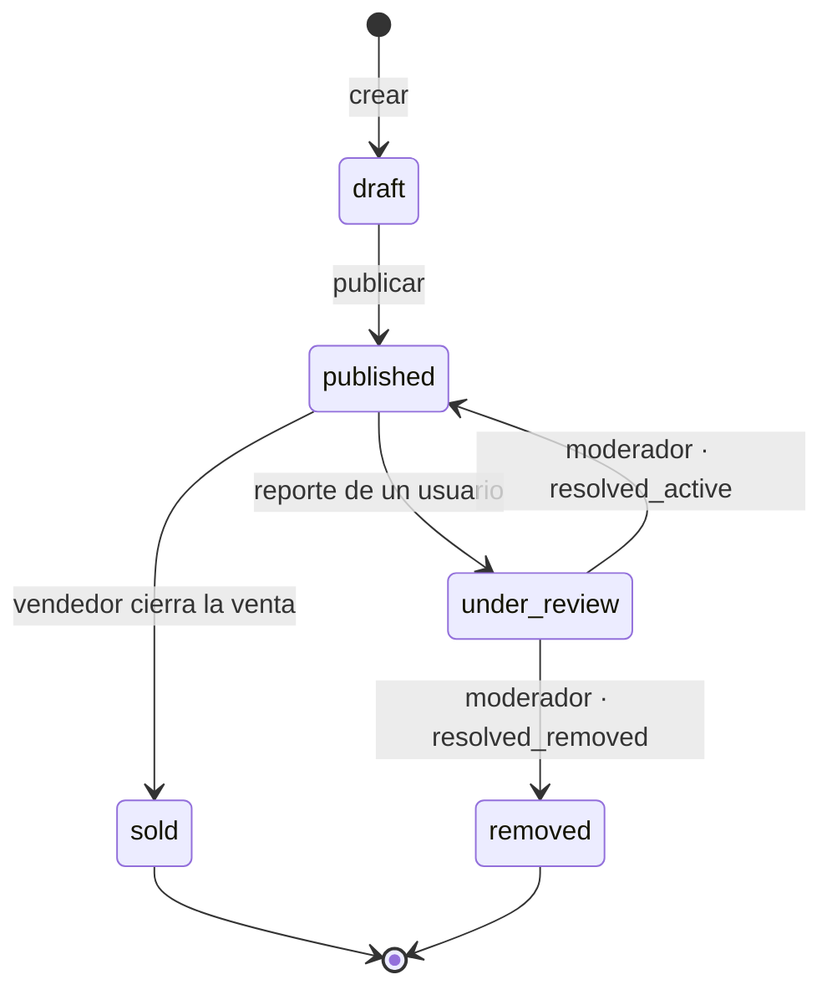

# 🛒 API — Plataforma de Compraventa de Segunda Mano


API REST para una plataforma de compraventa de artículos de segunda mano, al estilo de Vinted o Wallapop: publicación de artículos con fotos, búsqueda con filtros, mensajería interna entre comprador y vendedor, sistema de reportes con moderación y panel de administración con estadísticas.

Desarrollada como **Proyecto Final del Máster Full Stack Developer (UNIR)**. El cliente web es una SPA de Angular que vive en su propio repositorio: [UNIR-Proyecto-Final-Frontend](https://github.com/javimateo/UNIR-Proyecto-Final-Frontend).

---

## Índice

- [Características](#características)
- [Stack tecnológico](#stack-tecnológico)
- [Arquitectura](#arquitectura)
- [Estructura del proyecto](#estructura-del-proyecto)
- [Puesta en marcha](#puesta-en-marcha)
- [Variables de entorno](#variables-de-entorno)
- [Documentación de la API](#documentación-de-la-api)
- [Autenticación y roles](#autenticación-y-roles)
- [Ciclo de vida de un artículo](#ciclo-de-vida-de-un-artículo)
- [Modelo de datos](#modelo-de-datos)
- [Subida de imágenes](#subida-de-imágenes)
- [Despliegue](#despliegue)
- [Flujo de trabajo con Git](#flujo-de-trabajo-con-git)

---

## Características

- 🔐 **Autenticación JWT** — registro, login y sesión mediante token Bearer firmado.
- 👥 **Tres roles** con permisos diferenciados: usuario, moderador y administrador.
- 📦 **CRUD completo de artículos** con ciclo de vida (borrador → publicado → vendido/retirado), filtros combinables y paginación.
- 🖼️ **Subida de fotos** por artículo (multipart, JPG/PNG, máx. 5 MB) con orden configurable.
- 💬 **Mensajería interna** por artículo entre comprador y vendedor, con conversaciones, bandeja de entrada y marcado de leídos.
- ⭐ **Favoritos** por usuario.
- 🚩 **Sistema de reportes y moderación** — reportar un artículo lo pasa a "en revisión"; el moderador lo reactiva o lo retira.
- 📊 **Estadísticas globales** para el panel de administración (usuarios, artículos, reportes, actividad reciente).
- 📖 **Documentación viva** con Swagger UI en `/api/docs`.

## Stack tecnológico

| Tecnología | Versión | Uso |
|---|---|---|
| [Node.js](https://nodejs.org/) | 18+ | Entorno de ejecución |
| [Express](https://expressjs.com/) | 4.x | Framework HTTP y enrutado |
| [MySQL](https://www.mysql.com/) | 8+ | Base de datos relacional |
| [mysql2](https://github.com/sidorares/node-mysql2) | 3.x | Driver con *pool* de conexiones y promesas |
| [jsonwebtoken](https://github.com/auth0/node-jsonwebtoken) | 9.x | Emisión y verificación de JWT |
| [bcrypt](https://github.com/kelektiv/node.bcrypt.js) | 5.x | Hash de contraseñas (10 rondas) |
| [multer](https://github.com/expressjs/multer) | 1.x | Subida de imágenes multipart |
| [swagger-jsdoc](https://github.com/Surnet/swagger-jsdoc) + [swagger-ui-express](https://github.com/scottie1984/swagger-ui-express) | 6.x / 5.x | Documentación interactiva de la API |
| [dotenv](https://github.com/motdotla/dotenv) | 16.x | Configuración por variables de entorno |
| [cors](https://github.com/expressjs/cors) | 2.x | Peticiones cross-origin desde el frontend |
| [nodemon](https://nodemon.io/) | 3.x (dev) | Recarga automática en desarrollo |

## Arquitectura

Arquitectura en capas siguiendo el patrón **rutas → middlewares → controladores → modelos**, sin ORM: los modelos encapsulan SQL parametrizado directamente sobre el pool de `mysql2`.



- **Rutas** (`src/routes`) — declaran los endpoints de cada recurso y les asignan middlewares; contienen las anotaciones Swagger.
- **Middlewares** (`src/middlewares`) — `auth` (verifica el JWT y adjunta `req.user`), `role` (restringe por rol), `upload` (multer para imágenes) y `error` (manejador centralizado).
- **Controladores** (`src/controllers`) — validan la entrada, aplican las reglas de negocio (propiedad, estados, permisos) y componen la respuesta.
- **Modelos** (`src/models`) — una función por consulta, siempre con parámetros preparados (`?`) para prevenir inyección SQL.

## Estructura del proyecto

```
├── server.js                 # Punto de entrada: carga .env y levanta Express
├── db/
│   ├── BBDD.sql              # Esquema completo de la base de datos
│   └── seed_data.sql         # Datos de ejemplo (usuarios, artículos, mensajes…)
├── src/
│   ├── app.js                # App de Express: middlewares globales y montaje de rutas
│   ├── config/
│   │   ├── db.js             # Pool de conexiones MySQL (mysql2/promise)
│   │   └── swagger.js        # Configuración de swagger-jsdoc
│   ├── controllers/          # Un controlador por recurso
│   │   ├── auth.controller.js
│   │   ├── items.controller.js
│   │   ├── photos.controller.js
│   │   ├── users.controller.js
│   │   ├── categories.controller.js
│   │   ├── brands.controller.js
│   │   ├── favorites.controller.js
│   │   ├── messages.controller.js
│   │   ├── reports.controller.js
│   │   └── stats.controller.js
│   ├── middlewares/
│   │   ├── auth.middleware.js    # Verifica el Bearer token
│   │   ├── role.middleware.js    # requireRole('admin', 'moderator', …)
│   │   ├── upload.middleware.js  # Multer: destino, límite 5 MB, JPG/PNG
│   │   └── error.middleware.js   # Manejador de errores centralizado
│   ├── models/               # Consultas SQL de cada recurso
│   └── routes/               # Endpoints + anotaciones Swagger
├── API.md                    # Referencia detallada de la API (request/response)
├── BACKEND_PLAN.md           # Plan de desarrollo por fases
└── .env.example              # Plantilla de configuración
```

## Puesta en marcha

### Requisitos

- Node.js **18 o superior**
- MySQL **8 o superior**

### 1. Instalar dependencias

```bash
npm install
```

### 2. Configurar el entorno

```bash
cp .env.example .env
# Editar .env con las credenciales de tu MySQL
```

### 3. Crear la base de datos y cargar datos de ejemplo

```bash
mysql -u root -p < db/BBDD.sql
mysql -u root -p secondhand_platform < db/seed_data.sql
```

> El *seed* incluye usuarios de los tres roles y ~35 artículos ya publicados, ideal para desarrollar el frontend con datos realistas.

### 4. Arrancar

```bash
npm run dev    # desarrollo, con recarga automática (nodemon)
npm start      # producción
```

La API queda disponible en `http://localhost:3000` y la documentación interactiva en **`http://localhost:3000/api/docs`**.

## Variables de entorno

| Variable | Descripción | Ejemplo |
|---|---|---|
| `PORT` | Puerto del servidor | `3000` |
| `DB_HOST` | Host de MySQL | `localhost` |
| `DB_PORT` | Puerto de MySQL | `3306` |
| `DB_USER` | Usuario de MySQL | `root` |
| `DB_PASS` | Contraseña de MySQL | — |
| `DB_NAME` | Nombre de la base de datos | `secondhand_platform` |
| `JWT_SECRET` | Clave secreta para firmar los tokens | *(cadena aleatoria larga)* |
| `JWT_EXPIRES_IN` | Caducidad del token | `7d` |

## Documentación de la API

Dos fuentes complementarias:

- **[`API.md`](API.md)** — referencia completa con cuerpos de petición y respuesta de cada endpoint.
- **Swagger UI** en `/api/docs` — documentación interactiva generada desde las anotaciones de las rutas, con posibilidad de probar los endpoints.

Resumen de recursos:

| Recurso | Base | Endpoints principales | Acceso |
|---|---|---|---|
| Autenticación | `/api/auth` | `POST /register` · `POST /login` · `GET /me` | Público / 🔒 |
| Artículos | `/api/items` | `GET /` (filtros + paginación) · `GET /:id` · `POST /` · `PUT /:id` · `DELETE /:id` · `PATCH /:id/sell` | Público / 🔒 propietario |
| Fotos | `/api/items/:id/photos` * | `POST` (multipart) · `DELETE /:photoId` | 🔒 propietario |
| Usuarios | `/api/users` | `GET /` · `GET /:id` · `GET /:id/items` · `PUT /:id` · `PATCH /:id/role` · `PATCH /:id/status` · `DELETE /:id` | 🔒 según rol |
| Categorías | `/api/categories` | `GET /` · `POST /` · `PUT /:id` · `DELETE /:id` | Público / 🔒 admin |
| Marcas | `/api/brands` | `GET /` · `POST /` · `PUT /:id` · `DELETE /:id` | Público / 🔒 admin |
| Favoritos | `/api/favorites` | `GET /` · `POST /` · `DELETE /:id` | 🔒 |
| Mensajes | `/api/messages` | `POST /` · `GET /inbox` · `GET /conversations` · `GET /chat/:itemId/:userId` · `PATCH /:id/read` | 🔒 |
| Reportes | `/api/reports` | `POST /` · `GET /` · `GET /:id` · `PATCH /:id/resolve` | 🔒 / moderador |
| Estadísticas | `/api/admin/stats` | `GET /` | 🔒 admin |

> \* En la rama `develop` el router de fotos está montado temporalmente bajo `/api/photos`; el contrato objetivo documentado en `API.md` es `/api/items/:id/photos` (hay un fix pendiente).

El listado de artículos admite los filtros `search`, `category_id`, `brand_id`, `item_condition`, `min_price`, `max_price` y paginación con `page` y `per_page`, devolviendo `{ results, total, page, total_pages }`.

## Autenticación y roles

Los endpoints protegidos requieren el header:

```
Authorization: Bearer <token>
```

El token se obtiene en `POST /api/auth/login` y caduca según `JWT_EXPIRES_IN`. Sobre esa base, el middleware de roles restringe cada operación:

| Rol | Capacidades |
|---|---|
| `user` | Publicar, editar y vender **sus** artículos · mensajería · favoritos · reportar artículos ajenos |
| `moderator` | Todo lo anterior + revisar y resolver reportes · bloquear usuarios |
| `admin` | Control total: usuarios y roles, categorías, marcas, estadísticas, y cualquier acción de moderador |

Reglas de negocio destacadas: solo el propietario (o un admin) puede editar/eliminar un artículo; **solo el propietario** puede marcarlo como vendido; nadie puede reportar su propio artículo.

## Ciclo de vida de un artículo



| Estado | Significado |
|---|---|
| `draft` | Creado pero no visible públicamente |
| `published` | Visible en el listado público |
| `under_review` | Reportado; pendiente de decisión del moderador |
| `removed` | Retirado de la plataforma por moderación |
| `sold` | Transacción cerrada por el vendedor |

El listado público (`GET /api/items`) devuelve **únicamente** artículos `published`.

## Modelo de datos

Esquema completo en [`db/BBDD.sql`](db/BBDD.sql). Tablas principales:

| Tabla | Contenido |
|---|---|
| `users` | Cuentas con rol (`user`/`moderator`/`admin`) y estado (`active`/`blocked`/`deleted`) |
| `categories` / `brands` | Catálogo gestionado por el administrador |
| `items` | Artículos con precio, condición, especificaciones (JSON) y estado del ciclo de vida |
| `item_photos` | Fotos de cada artículo con orden (`sort_order`) |
| `conversations` / `messages` | Mensajería interna por artículo (comprador ↔ vendedor) |
| `reports` | Reportes con motivo, estado y resolución del moderador |
| `favorites` | Relación usuario ↔ artículo |
| `valuations` | Valoraciones entre usuarios *(tabla creada; endpoints pendientes)* |

## Subida de imágenes

- Endpoint multipart con campo **`image`** (una imagen por petición).
- Formatos **JPG/PNG**, tamaño máximo **5 MB** (validado por multer).
- Los ficheros se guardan en `uploads-imagen/` y se sirven como estáticos en `GET /uploads-imagen/<fichero>`; las URLs que devuelve la API son relativas (el cliente debe anteponer la URL base del backend).

> ⚠️ En plataformas con filesystem efímero (como Railway) los ficheros subidos se pierden en cada redeploy. Para producción real, considerar un almacenamiento externo (S3, Cloudinary…).

## Despliegue

El proyecto está desplegado en **[Railway](https://railway.app/)**:

```
https://unir-proyecto-final-backend-production.up.railway.app
```

Railway inyecta las variables de entorno desde su panel y ejecuta `npm start`. Para cualquier otro proveedor solo se necesita Node 18+, una instancia MySQL accesible y las variables del apartado anterior.

## Flujo de trabajo con Git

| Rama | Uso |
|---|---|
| `main` | Código estable. Solo recibe merges desde `develop`. |
| `develop` | Rama base del equipo. Punto de partida para todo. |
| `feature/<nombre>` | Nueva funcionalidad. Sale de `develop`, vuelve a `develop` vía PR. |
| `fix/<nombre>` | Corrección de bug. Sale de `develop`, vuelve a `develop` vía PR. |
| `docs/<nombre>` | Cambios de documentación. Sale de `develop`, vuelve a `develop` vía PR. |

```bash
# 1. Sincronizar develop
git checkout develop && git pull origin develop

# 2. Crear la rama de trabajo
git checkout -b feature/mi-funcionalidad

# 3. Commitear siguiendo la convención
git commit -m "feat: descripción del cambio"

# 4. Publicar y abrir PR hacia develop
git push origin feature/mi-funcionalidad
```

**Convención de commits:** `feat:` nueva funcionalidad · `fix:` corrección · `docs:` documentación · `refactor:` cambio sin funcionalidad nueva · `chore:` mantenimiento.

**Pull Requests:** toda rama se integra en `develop` exclusivamente mediante PR, revisado y aprobado por otro miembro del equipo (el autor no mergea su propio PR). Borrar la rama tras el merge.

---

## Documentación relacionada

- [`API.md`](API.md) — referencia detallada de todos los endpoints
- [`BACKEND_PLAN.md`](BACKEND_PLAN.md) — plan de desarrollo por fases
- [`db/BBDD.sql`](db/BBDD.sql) — esquema de base de datos · [`db/seed_data.sql`](db/seed_data.sql) — datos de ejemplo
- Enunciado del proyecto — `enunciado.md` en el repositorio del frontend
